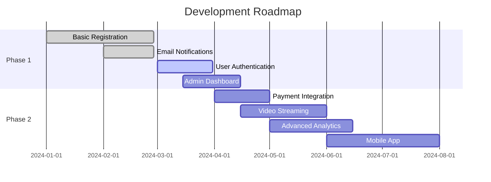

# 🎯 Advanced Webinar Registration Platform

**Modern, full-stack webinar management solution built for the future**

---

## ✨ **Overview**

A comprehensive webinar registration and management platform featuring beautiful gradient UI, robust Spring Boot backend, and seamless user experience. Perfect for hosting virtual events with real-time registration tracking and automated email notifications.

### 🎨 **Key Features**

- **Beautiful UI/UX** - Modern gradient design with responsive layout
- **Real-time Registration** - Instant registration with progress tracking  
- **User Management** - Complete attendee management system
- **Email Integration** - Automated confirmation and reminder emails
- **Analytics Dashboard** - Comprehensive registration analytics
- **Secure Authentication** - JWT-based authentication system
- **Mobile Responsive** - Perfect experience across all devices

---

## 🛠️ **Tech Stack**

### Frontend

### Backend

### Database & Tools

---

## 🤝 **Contributing**

**Join our community of developers and help build the future of webinar platforms!**

### 🎯 **We Need Help With**

| Area | Description | Skills |
|------|-------------|--------|
| 🎨 **Frontend** | UI/UX improvements, animations | HTML, CSS, JavaScript |
| ⚙️ **Backend** | API endpoints, optimization | Java, Spring Boot |
| 🧪 **Testing** | Unit & integration tests | JUnit, Mockito |
| 📖 **Documentation** | Code documentation, guides | Markdown |
| 🚀 **DevOps** | CI/CD, Docker optimization | Docker, GitHub Actions |
| 📱 **Mobile** | Mobile app development | React Native, Flutter |

### 🔄 **How to Contribute**

1. Fork the repository
2. Create your feature branch (`git checkout -b feature/amazing-feature`)
3. Commit your changes (`git commit -m 'Add amazing feature'`)
4. Push to the branch (`git push origin feature/amazing-feature`)
5. Open a Pull Request

---

## 📈 **Roadmap**

### Current Status
- ✅ **Phase 1**: Basic registration system, Email notifications
- 🔄 **Phase 1**: User authentication, Admin dashboard  
- 📋 **Phase 2**: Payment integration, Video streaming, Mobile app

---

## 📞 **Contact**

**Let's connect and build something amazing together!**

**⭐ Star this project if you find it helpful!**

